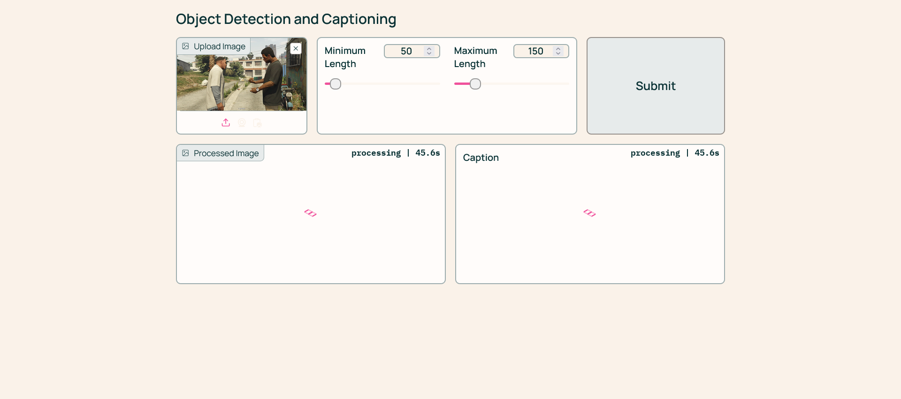
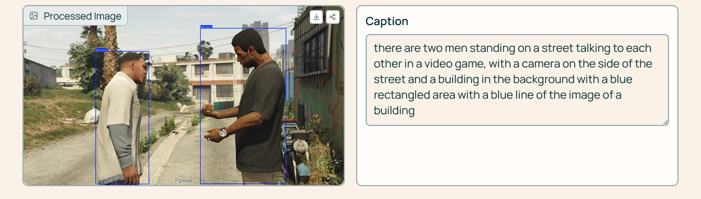
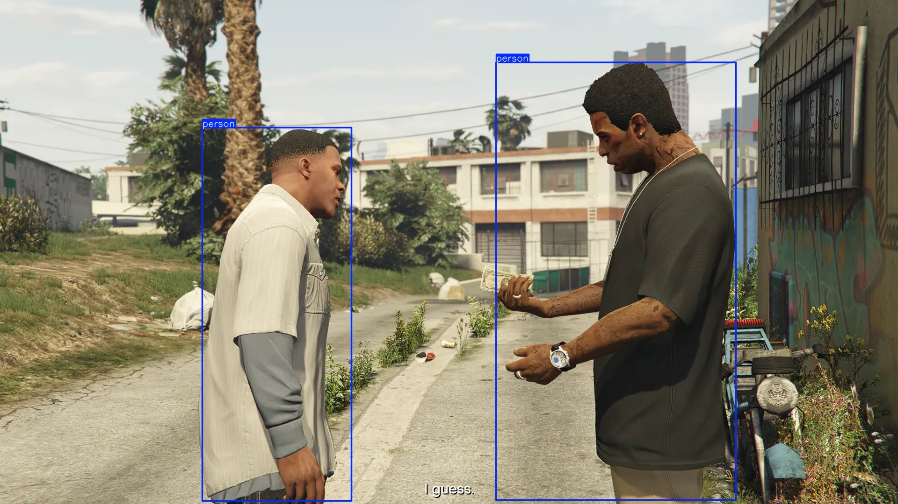

Check out the configuration reference at https://huggingface.co/docs/hub/spaces-config-reference

Spaces 🔗 : https://huggingface.co/spaces/prithivMLmods/YOLO-NMS

## git lfs - https ---

    # Make sure you have git-lfs installed (https://git-lfs.com)
    git lfs install
    
    git clone https://huggingface.co/spaces/prithivMLmods/YOLO-NMS
    
    # If you want to clone without large files - just their pointers
    
    GIT_LFS_SKIP_SMUDGE=1 git clone https://huggingface.co/spaces/prithivMLmods/YOLO-NMS

## git lfs - ssh ---

    # Make sure you have git-lfs installed (https://git-lfs.com)
    git lfs install
    
    git clone git@hf.co:spaces/prithivMLmods/YOLO-NMS
    
    # If you want to clone without large files - just their pointers
    
    GIT_LFS_SKIP_SMUDGE=1 git clone git@hf.co:spaces/prithivMLmods/YOLO-NMS

## Input Image Processing ( Yolo obd - You Only Look Once, Image caption salesforce blip )

## The Processed Outcome 

## The Resultant Image

## The requirements ⬇️

| Package                      | Description                                      |
|------------------------------|--------------------------------------------------|
| `ultralytics`                | Ultralytics YOLO models for object detection.    |
| `gradio`                     | Create customizable web-based interfaces.        |
| `opencv-python-headless`     | OpenCV without GUI features.                     |
| `spaces`                     | Hugging Face Spaces for deploying applications.  |
| `lapx>=0.5.2`                | Linear assignment problem solver.                |
| `shapely>=2.0.0`             | Geometric objects manipulation.                  |
| `transformers`               | Hugging Face's transformer models.               |
| `torch`                      | PyTorch for deep learning.                       |

.

.

.@prithivmlmods-hf
