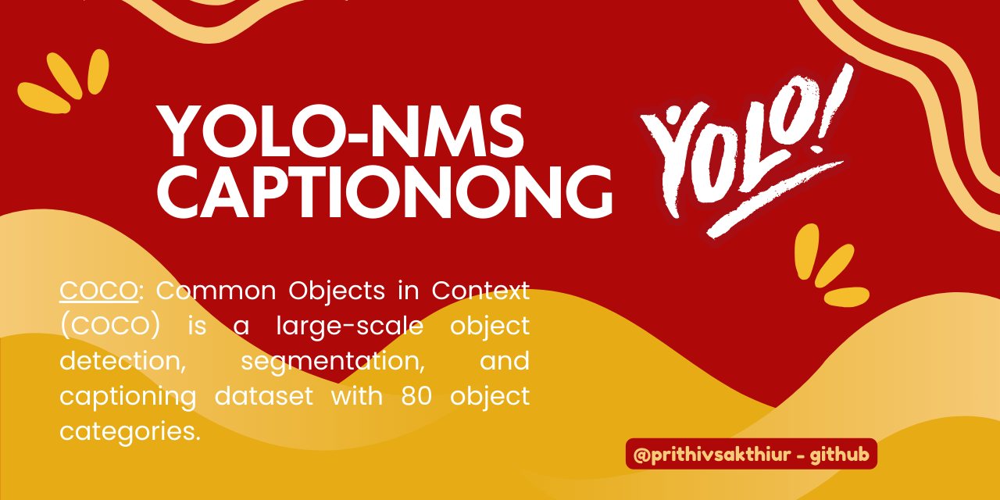

Check out the configuration reference at https://huggingface.co/docs/hub/spaces-config-reference

Spaces 🔗 : https://huggingface.co/spaces/prithivMLmods/YOLO-NMS

## git lfs - https

    # Make sure you have git-lfs installed (https://git-lfs.com)
    git lfs install
    
    git clone https://huggingface.co/spaces/prithivMLmods/YOLO-NMS
    
    # If you want to clone without large files - just their pointers
    
    GIT_LFS_SKIP_SMUDGE=1 git clone https://huggingface.co/spaces/prithivMLmods/YOLO-NMS

## git lfs - ssh

    # Make sure you have git-lfs installed (https://git-lfs.com)
    git lfs install
    
    git clone git@hf.co:spaces/prithivMLmods/YOLO-NMS
    
    # If you want to clone without large files - just their pointers
    
    GIT_LFS_SKIP_SMUDGE=1 git clone git@hf.co:spaces/prithivMLmods/YOLO-NMS

## Input Image Processing ( yolo obd, caption )
